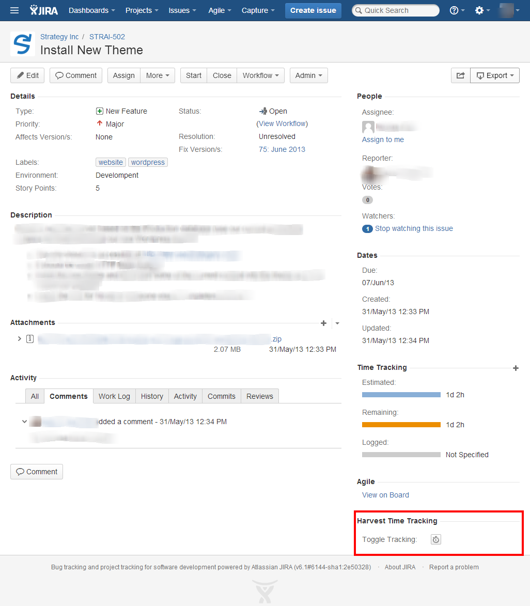
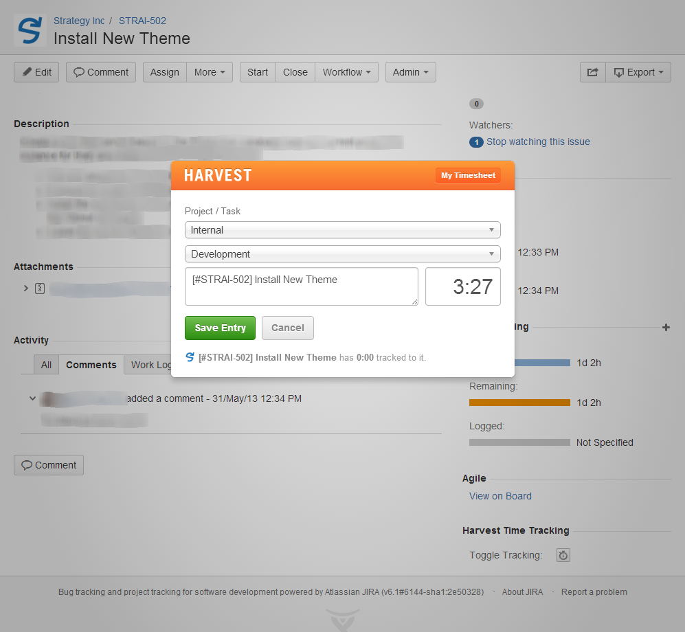

Harvest Real-Time Tracking - by Strategery
=========================

**NEW!** We're raising funds to integrate with JIRA's Worklogs, and we'd appreciate your help! You can contribute here: http://igg.me/at/jira-harvest/x/5397316

Track time in Harvest directly from your JIRA issues!

Download this **free** JIRA Plugin at: https://marketplace.atlassian.com/1211356

### OnDemand Support
This plugin is not yet available for OnDemand. As shown in the roadmap below we're planning on adding it there right after we integrate it with JIRA Worklogs. We appreciate your reviews asking for OnDemand availability and we'll do our best to have that ready as soon as possible.

### Found a Bug?

If you find a bug with the add-on please report it in the [Issues](https://github.com/Strategery-Inc/jira-harvest-time-tracker/issues) section. We'll make sure its squashed quickly!

Please make sure the bug has not been reported already. If it has, feel free to comment on the thread to tell us you run into it, too. When reporting an issue please submit as much details as possible, its usually very important for us to be able to duplicate the bug in our own environment.

### Support

We don't offer direct support for this add-on. But you'll find anything you need in the [Wiki](https://github.com/Strategery-Inc/jira-harvest-time-tracker/wiki).

# Screenshots

##### Widget Location

##### Harvest Popup

